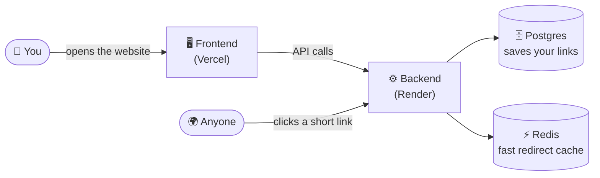
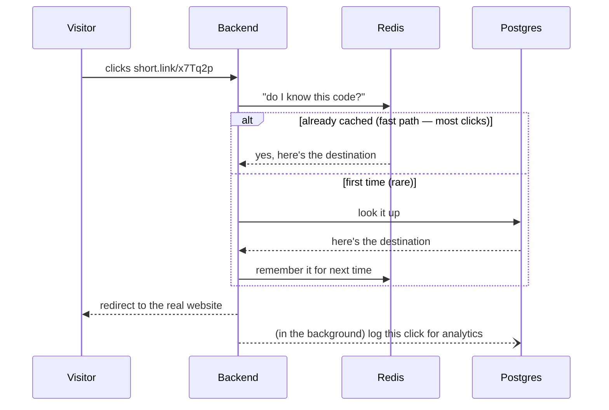
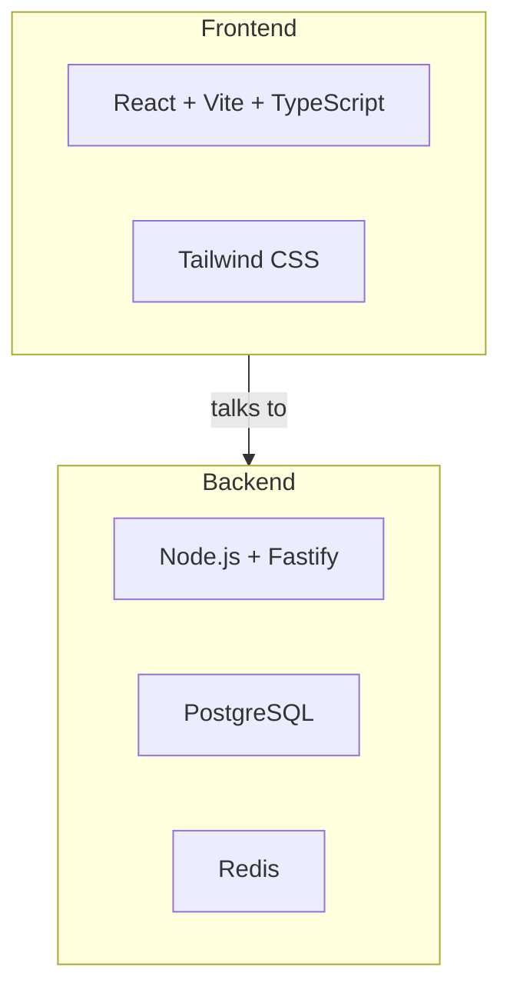

# 🔗 Shortlink — Simple Guide

A quick, visual tour of this project. For the full technical deep-dive
(security, scaling, every design decision explained), see
[`README.md`](README.md) — this file is the short version.

**Live app:** your Vercel URL · **API:** your Render URL

---

## 🤔 What is this?

A URL shortener — like Bitly or TinyURL. Paste a long link, get a short
one back. Click it, and it sends you to the original page.

But it also does more than the basic version:

| Feature | What it means |
|---|---|
| 🔑 Custom aliases | `short.link/spring-sale` instead of `short.link/x7Tq2p` |
| 📊 Click analytics | See where clicks come from — country, device, referrer |
| ⏰ Expiring links | A link that stops working after a date or click limit |
| 🔒 Password-protected links | Visitor must enter a password before redirecting |
| 👤 Accounts + API keys | Manage all your links from one dashboard |

---

## 🗺️ How the pieces fit together

- **Frontend** — the website you see and click around (React)
- **Backend** — the brain: creates links, checks passwords, tracks clicks (Node.js)
- **Postgres** — the permanent filing cabinet (every link ever created)
- **Redis** — a fast sticky-note cache, so clicking a link is instant

---

## 🖱️ What happens when someone clicks a short link

The visitor never waits for the analytics logging — that happens quietly
after the redirect, so clicking a link always feels instant.

---

## 🧱 Tech stack at a glance

| Layer | Tools |
|---|---|
| Frontend | React, Vite, TypeScript, Tailwind CSS |
| Backend | Node.js, Fastify, TypeScript |
| Database | PostgreSQL |
| Cache / Queue | Redis, BullMQ |
| Hosting | Vercel (frontend) + Render (backend) |

---

## 📁 Where things live

`frontend/` = the website (Vercel) · `src/` = the backend API (Render) · `scripts/` = setup tools · `tests/` = automatic checks · `render.yaml` = auto-setup config

---

## 🚀 Want to run it yourself?

The full step-by-step (including free hosting setup) is in
[`README.md`](README.md#0-deploy-your-own-copy-in-10-minutes-no-local-setup-required).
Short version:

1. Fork this repo
2. Deploy `/` (the root) to [Render](https://render.com) → gives you the backend
3. Deploy `/frontend` to [Vercel](https://vercel.com) → gives you the website
4. Connect the two with one environment variable

No credit card, no local setup — just two free accounts and a few clicks.

---

## ✅ Is it actually production-ready?

Yes — this isn't a toy project. It includes things real companies need:
security checks against malicious links (SSRF protection), rate limiting,
hashed passwords and API keys, automatic database migrations, and a full
test suite that runs against a real database before anything ships. The
`README.md` explains each of these decisions in depth, including real
bugs that were caught and fixed along the way.
