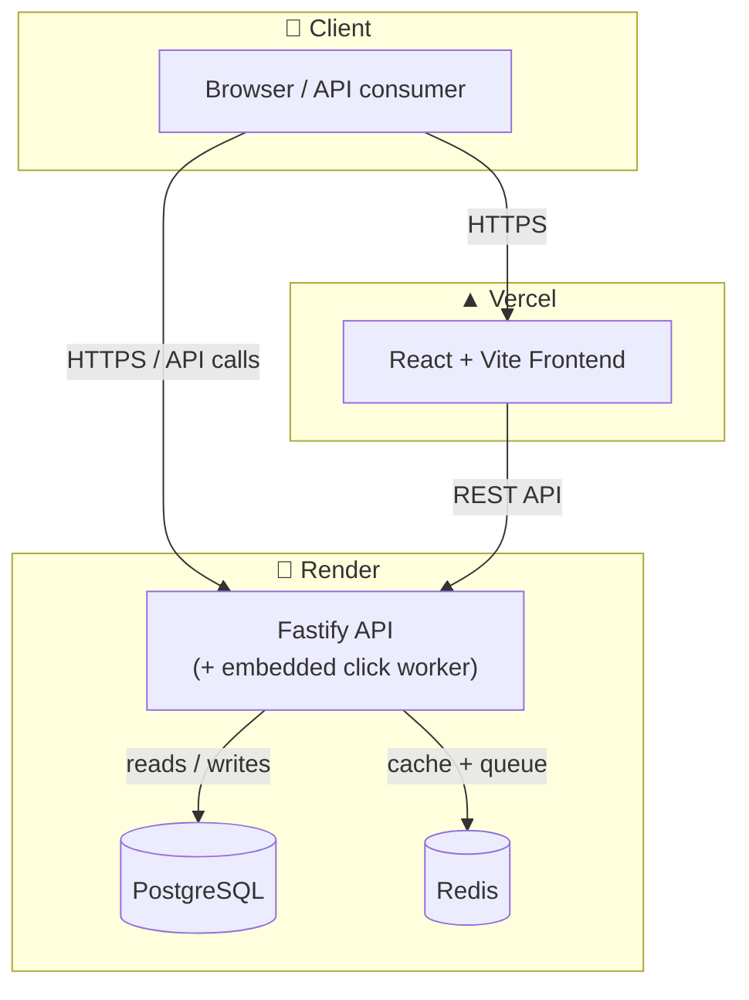
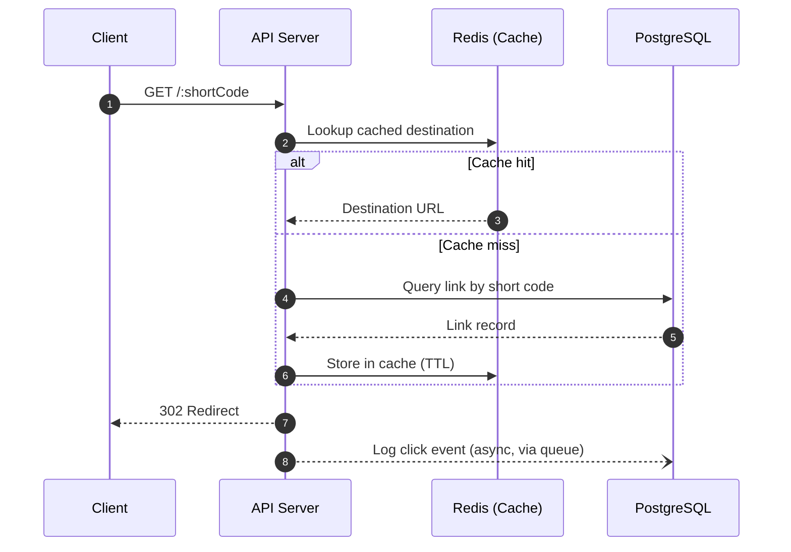
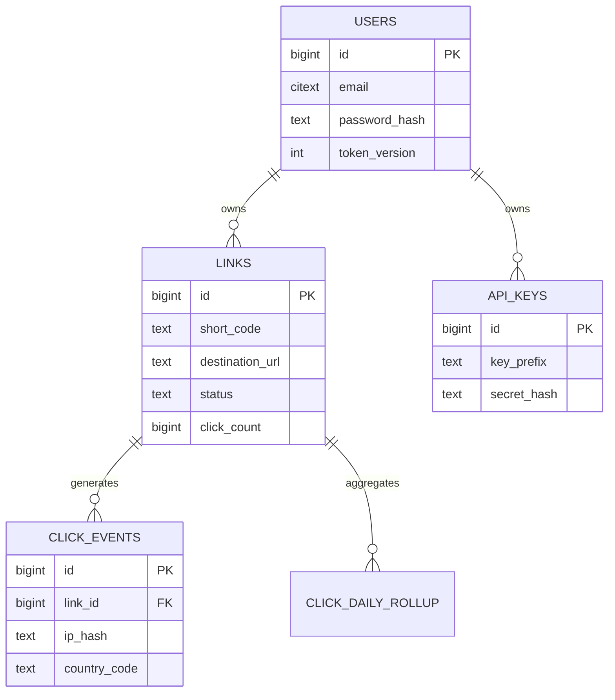

<div align="center">

# 🔗 Shortlink Platform

**A production-grade URL shortener** — built with security, scalability, and real-world operability in mind, not just a toy `id → url` lookup table.

[](https://nodejs.org)
[](https://www.typescriptlang.org)
[](https://fastify.dev)
[](https://react.dev)
[](https://www.postgresql.org)
[](https://redis.io)
[](tests)
[](#license)

[**🌐 Live Demo**](https://get-shorturl.vercel.app) · [**📖 Simple Guide**](GUIDE.md) · [**📡 API Docs**](https://shortlink-api-0ql2.onrender.com/docs) · [**🐛 Report an Issue**](../../issues)

</div>

---

## 📑 Table of Contents

- [Overview](#-overview)
- [Features](#-features)
- [Architecture](#-architecture)
- [Tech Stack](#-tech-stack)
- [Getting Started](#-getting-started)
- [Deployment](#-deployment)
- [API Reference](#-api-reference)
- [Database Schema](#-database-schema)
- [Security](#-security)
- [Testing & Quality](#-testing--quality)
- [Project Structure](#-project-structure)
- [Known Limitations](#-known-limitations)
- [Contributing](#-contributing)
- [License](#-license)

---

## 🌟 Overview

Shortlink Platform turns long URLs into short, shareable links — the same idea behind Bitly or TinyURL — but built as a complete, production-ready system rather than a weekend script. It includes real authentication, per-link analytics, password-protected and expiring links, rate limiting, SSRF-hardened URL validation, and a fully automated deployment pipeline.

The project is split into two independently deployable pieces:

| Piece | Description | Hosted on |
|---|---|---|
| **Frontend** | React SPA — landing page, dashboard, analytics, auth | [Vercel](https://vercel.com) |
| **Backend** | REST API, database, cache, and background worker | [Render](https://render.com) |

Both are free to run and deploy with zero local setup — see [Deployment](#-deployment).

---

## ✨ Features

**Core**
- 🔗 Instant link shortening — anonymous *or* with an account
- 🏷️ Custom aliases (`/spring-sale` instead of `/x7Tq2p`)
- ⏳ Expiring links (by date or click count)
- 🔒 Password-protected links with a dedicated unlock page
- 📱 Auto-generated QR codes for every link

**Analytics & Management**
- 📊 Per-link analytics — clicks over time, top referrers, countries, and device types
- 📁 Dashboard to create, edit, tag, and delete links
- 🔑 API key management with scoped permissions, for programmatic access

**Engineering**
- 🛡️ SSRF-hardened URL validation (blocks private/internal IP targets)
- ⚡ Redis-cached redirects with stampede protection for high-traffic links
- 🧵 Asynchronous click analytics via a background job queue (never blocks a redirect)
- 🔐 Argon2id password hashing, hashed API keys, JWT auth with refresh-token revocation
- 🚦 Per-user and per-endpoint rate limiting

---

## 🏗️ Architecture



**How a redirect is resolved** — the hot path that runs on every single link click, optimized to avoid a database hit whenever possible:



The client is redirected immediately — click logging happens in the background via a job queue, so analytics tracking never adds latency to a redirect.

> ℹ️ In the reference architecture, the click-analytics worker runs as its **own independently scaled service**. On the free-tier deployment described in this README, it runs embedded inside the API process instead (`EMBED_WORKER=true`) to avoid needing a paid background-worker plan. See [Known Limitations](#-known-limitations).

---

## 🧰 Tech Stack

| Layer | Technology |
|---|---|
| **Frontend** | React 18, Vite, TypeScript, Tailwind CSS, React Router, Recharts |
| **Backend** | Node.js 20, Fastify, TypeScript, Zod |
| **Database** | PostgreSQL 16 (partitioned tables for click analytics) |
| **Cache / Queue** | Redis, BullMQ |
| **Auth** | JWT (access + refresh), Argon2id, hashed API keys |
| **Testing** | Vitest, Supertest (against real Postgres/Redis, not mocks) |
| **CI/CD** | GitHub Actions |
| **Hosting** | Vercel (frontend) · Render (backend) |

---

## 🚀 Getting Started

### Prerequisites

- **Node.js 20+**
- A **PostgreSQL** instance (local, [Docker](https://www.docker.com), or a free hosted database like [Neon](https://neon.tech))
- A **Redis** instance (local or a free hosted instance)

### 1. Clone the repository

```bash
git clone https://github.com/skgpt254/Url-Shortner.git
cd Url-Shortner
```

### 2. Configure the backend

```bash
cp .env.example .env
```

Open `.env` and fill in `DATABASE_URL`, `REDIS_URL`, then generate the required secrets:

```bash
sed -i "s/changeme_access_secret_min_32_bytes_long/$(openssl rand -hex 32)/" .env
sed -i "s/changeme_refresh_secret_min_32_bytes_long/$(openssl rand -hex 32)/" .env
sed -i "s/changeme_shortcode_secret_min_32_bytes_long/$(openssl rand -hex 32)/" .env
sed -i "s/changeme_ip_hash_salt/$(openssl rand -hex 16)/" .env
```

### 3. Install, migrate, and run

```bash
npm install
npm run migrate
npm run dev
```

The API is now live at **`http://localhost:3000`**, with interactive docs at **`/docs`**.

### 4. Configure and run the frontend

In a second terminal:

```bash
cd frontend
npm install
cp .env.example .env
npm run dev
```

The web app is now live at **`http://localhost:5173`** (it proxies API calls to `localhost:3000` automatically).

### 5. Seed demo data (optional)

```bash
npm run seed
```

This creates a demo account and prints a ready-to-use API key.

---

## ☁️ Deployment

This project deploys as two free-tier services with **no manual server setup** — the backend even runs its own database migrations on boot.

### Backend → Render

[](https://render.com/deploy?repo=https://github.com/skgpt254/Url-Shortner)

1. Click the button above → connect your fork of this repo.
2. Render reads `render.yaml` and provisions a **web service**, a **free PostgreSQL database**, and a **free Redis instance** automatically.
3. Once live, set two environment variables on the service (Render will prompt for these): `PUBLIC_BASE_URL` and `SHORTLINK_DOMAINS`, both set to the URL Render assigns you.

### Frontend → Vercel

[](https://vercel.com/new/clone?repository-url=https://github.com/skgpt254/Url-Shortner&root-directory=frontend)

1. Click the button above → import the same repository.
2. Set **Root Directory** to `frontend`.
3. Add one environment variable: `VITE_API_BASE_URL` → your Render backend URL.
4. Deploy.

### Connect the two

Back on Render, set `ALLOWED_ORIGINS` to your new Vercel URL — this is the CORS allowlist that lets the frontend talk to the backend securely.

> 📝 **Free-tier notes:** Render's free web service spins down after 15 minutes of inactivity (a ~30–60s cold start on the next request), and its free PostgreSQL database expires after 30 days. For a long-lived free database, point `DATABASE_URL` at [Neon](https://neon.tech) instead — no code changes required.

---

## 📡 API Reference

Full interactive documentation (OpenAPI/Swagger) is available at **`/docs`** on any running instance. Summary of the main endpoints:

| Method | Endpoint | Auth | Description |
|---|---|---|---|
| `POST` | `/api/v1/auth/register` | — | Create an account |
| `POST` | `/api/v1/auth/login` | — | Sign in, receive tokens |
| `POST` | `/api/v1/links/quick` | — | Anonymously shorten a URL |
| `POST` | `/api/v1/links` | ✅ | Create a link (custom alias, expiry, password, tags) |
| `GET` | `/api/v1/links` | ✅ | List your links |
| `PATCH` | `/api/v1/links/:code` | ✅ | Update a link |
| `DELETE` | `/api/v1/links/:code` | ✅ | Delete a link |
| `GET` | `/api/v1/links/:code/analytics` | ✅ | Click analytics for a link |
| `POST` | `/api/v1/api-keys` | ✅ | Generate an API key |
| `GET` | `/:code` | — | **The redirect itself** |
| `GET` | `/:code/qr` | — | QR code image for the link |

**Example — create a link:**

```bash
curl -X POST https://shortlink-api-0ql2.onrender.com/api/v1/links \
  -H "Authorization: Bearer <your-api-key>" \
  -H "Content-Type: application/json" \
  -d '{
        "url": "https://example.com/a/very/long/path",
        "customAlias": "my-link",
        "expiresAt": "2026-12-31T23:59:59Z"
      }'
```

```json
{
  "link": {
    "shortCode": "my-link",
    "shortUrl": "https://shortlink-api-0ql2.onrender.com/my-link",
    "destinationUrl": "https://example.com/a/very/long/path",
    "status": "active",
    "clickCount": 0
  }
}
```

---

## 🗄️ Database Schema



`click_events` is **partitioned by month** — click volume grows unbounded over time, and dropping an old partition is an instant metadata operation instead of a slow row-by-row `DELETE`.

---

## 🔐 Security

Security was treated as a first-class requirement, not an afterthought:

- **SSRF protection** — every destination URL is validated against private/reserved IP ranges (including cloud metadata endpoints like `169.254.169.254`) before a link is created.
- **No plaintext secrets, ever** — passwords use **Argon2id**; API keys are stored only as a **SHA-256 hash** of their secret half.
- **JWT with real revocation** — short-lived access tokens, longer-lived refresh tokens tied to a per-user `token_version` so "log out everywhere" actually works.
- **Rate limiting** — an atomic Redis-backed token bucket, applied per user/IP and per endpoint.
- **Privacy-conscious analytics** — visitor IP addresses are **hashed with a salt before storage**; raw IPs are never persisted.
- **Automatic data retention** — old click-event partitions are dropped after a configurable retention window.

---

## 🧪 Testing & Quality

This project is tested against **real PostgreSQL and Redis instances**, not mocks — because the bugs that actually matter (race conditions, unique-constraint edge cases, SSRF bypasses) only show up against real infrastructure. That process caught genuine bugs before they reached production, including:

- A silent 32-bit integer overflow in the short-code generator
- A Postgres unique-index gap that would have allowed duplicate aliases
- An error-handling gap that turned a validation failure into a raw 500

```bash
npm test               # unit + integration tests
npm run test:coverage  # with coverage report
```

---

## 📁 Project Structure

```
Url-Shortner/
├── frontend/               # React + Vite + TypeScript web app
│   └── src/
│       ├── api/             # Typed API client with auto token-refresh
│       ├── components/      # Reusable UI components
│       ├── context/         # Auth state management
│       └── pages/            # Landing, Dashboard, Analytics, Auth
├── src/                    # Backend source
│   ├── config/               # Environment validation
│   ├── db/                   # Postgres client + migrations
│   ├── lib/                  # Shortcode generator, URL validator, cache, rate limiter
│   ├── middleware/           # Auth, rate limiting, error handling
│   ├── modules/               # auth · links · redirect · analytics · apikeys
│   ├── queue/                 # Background job (BullMQ) wiring
│   ├── app.ts                 # Fastify app factory
│   └── server.ts               # Entry point
├── scripts/                # Migration runner, database seeding, maintenance
├── tests/                  # Unit + integration tests
├── render.yaml              # One-click backend deployment (Render)
├── Dockerfile               # Backend container image
└── docker-entrypoint.sh     # Runs migrations automatically on boot
```

---

## ⚠️ Known Limitations

Documented deliberately, not hidden:

- **No multi-tenancy** — links belong to a single user; team/workspace support isn't implemented.
- **Bulk creation is synchronous** — fine for small batches (≤500), not a true background import pipeline.
- **The click worker runs embedded in the API process** on the free-tier deployment (see [Architecture](#-architecture)) rather than as an independently scaled service.
- **No automated malicious-URL scanning** — the SSRF guard is real and always-on, but a full safe-browsing integration isn't wired up.

---

## 🤝 Contributing

Issues and pull requests are welcome. If you're extending this project, the [architecture section](#-architecture) and inline code comments explain the reasoning behind most non-obvious decisions.

---

## 📄 License

This project is available under the [MIT License](LICENSE).

---

<div align="center">

Built by **[Sandesh Kumar Gupta](https://github.com/skgpt254)**

</div>